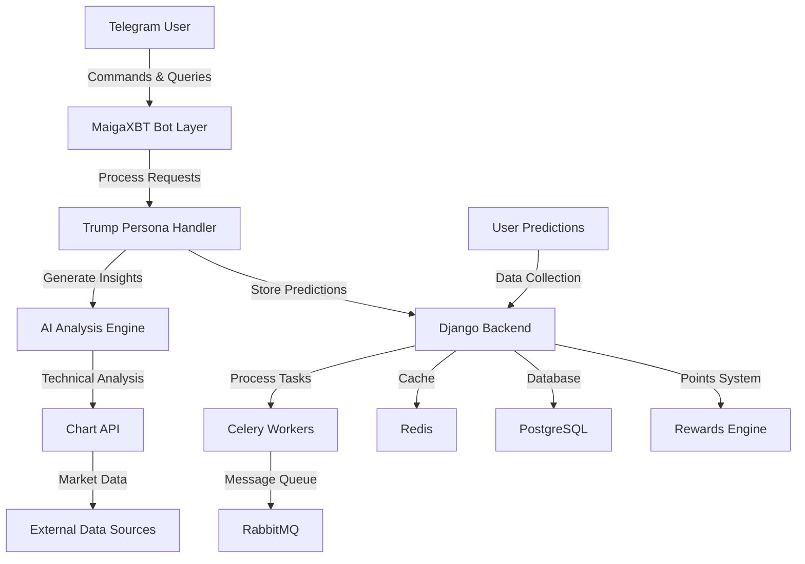

# MaigaXBT

An innovative AI-powered trading assistant that combines technical analysis with a unique Donald Trump persona to provide trading insights and predictions.

## Overview

MaigaXBT is a cutting-edge AI agent that delivers trading insights through an engaging Telegram interface. By leveraging advanced technical indicators and a distinctive Donald Trump persona, it provides users with actionable trading signals while collecting valuable prediction data for AI training.

## High-Level Protocol Architecture



## Features

- **Trump-Persona AI Agent**
  - Engaging communication style
  - Memorable trading insights
  - Interactive user experience
  - Real-time market commentary

- **Trading Signal Generation**
  - Technical indicator analysis
  - Market trend predictions
  - Entry/exit point suggestions
  - Risk level assessment

- **Prediction & Rewards System**
  - User signal prediction platform
  - Points-based reward system
  - Future airdrop eligibility
  - Leaderboard rankings

- **Data Collection & Annotation**
  - User prediction tracking
  - Signal accuracy analysis
  - Market sentiment data
  - Training data generation

- **Technical Analysis Tools**
  - Multiple timeframe analysis
  - Custom indicator overlays
  - Volume analysis
  - Pattern recognition

## Use Cases

1. **Trading Signal Reception**
   - Receive AI-generated trading signals
   - Get Trump-style market commentary
   - Access risk management insights
   - Track signal performance

2. **Prediction Participation**
   - Predict upcoming signals
   - Earn points for accuracy
   - Compete on leaderboards
   - Qualify for future airdrops

3. **Market Analysis**
   - Access technical analysis
   - View market trends
   - Monitor key indicators
   - Track prediction accuracy

4. **Community Engagement**
   - Interact with Trump persona
   - Share trading insights
   - Track performance metrics
   - Earn rewards

## Technical Implementation

### Backend Stack
- **Django**: Main web framework
- **Django REST Framework**: API development
- **Celery**: Asynchronous task processing
- **RabbitMQ**: Message broker
- **Redis**: Caching and real-time data
- **PostgreSQL**: Primary database

### Bot Implementation
- **Aiogram**: Telegram bot framework
- **Python 3.12**: Core programming language
- **Chart API**: Technical analysis visualization
- **AI Models**: Signal generation and Trump persona

### Infrastructure
- **Docker**: Containerization
- **Docker Compose**: Service orchestration
- **AWS S3**: File storage (optional)
- **Sentry**: Error tracking

## Quick Start

### Prerequisites
- Python 3.12+
- Docker and Docker Compose
- Telegram Bot Token

### Local Development Setup

1. **Clone the Repository**
   ```bash
   git clone [repository-url]
   cd maigaxbt
   ```

2. **Set Up Environment**
   ```bash
   python3.12 -m venv .venv
   source .venv/bin/activate
   pip install -r requirements-dev.txt
   ```

3. **Configure Environment Variables**
   ```bash
   cp .env.example .env
   # Edit .env with your configuration
   ```

4. **Start Services**
   ```bash
   # Start Django server
   make run.server.local
   
   # Start MaigaXBT bot
   make run.bot.local
   ```

### Docker Setup

1. **Build and Start Services**
   ```bash
   docker compose up -d
   ```

2. **Run Migrations**
   ```bash
   docker compose exec web python manage.py migrate
   ```

## License

This project is temporarily public for review and evaluation purposes. All rights reserved. The code, documentation, and associated materials are proprietary and confidential. Unauthorized copying, modification, distribution, or use of this software is strictly prohibited.

## Additional Information

### API Documentation
- Available at `/api/schema/` when running the server
- Swagger UI at `/api/schema/swagger-ui/`
- ReDoc at `/api/schema/redoc/`

### Monitoring
- Sentry integration for error tracking
- Django Silk for performance profiling
- Custom logging system

### Security
- JWT authentication
- Rate limiting
- CORS protection
- Input validation

### Contributing
This is a proprietary project. Please contact the maintainers for any questions or feedback.

### Support
For support or inquiries, please reach out through the project's communication channels.
